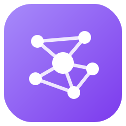
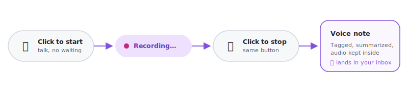
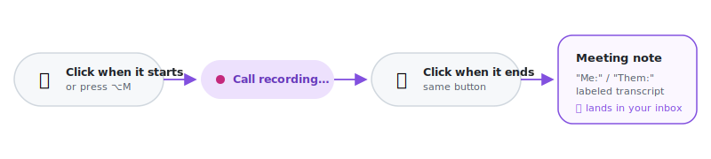

<p align="center">
  
</p>

<h1 align="center">Nous</h1>

<p align="center">
  <a href="https://obsidian.md/plugins?id=nous"></a>
  
  <a href="LICENSE"></a>
</p>

Capture anything — a typed thought, a voice memo, pasted meeting notes, a
photo, a PDF — and Nous turns it into a tagged, linked knowledge graph
inside Obsidian.
Every capture gets summarized and connected to related notes automatically,
and once a topic has enough notes behind it, Nous writes a wiki page
pulling everything together.

No coding needed. Everything happens inside Obsidian.

<picture>
  <source media="(prefers-color-scheme: dark)" srcset="assets/pipeline-dark.svg">
  
</picture>

## Install

1. In Obsidian: **Settings → Community plugins**, turn community plugins on.
2. **Browse**, search **"Nous"**, click **Install**, then **Enable**.

That's it — or use the badge above to jump straight to Nous's page on
[Obsidian's site](https://obsidian.md/plugins?id=nous).

## Quickstart

**1. Enable Nous** — a setup wizard opens automatically and asks one
question: Claude subscription, an API key, or a local model? Pick one, it
tests the connection, done.

**2. Capture something.** Four ways in, all in the left sidebar:

| | |
|---|---|
| ➕ | Type, paste, or attach a file — command palette → "Nous: Quick capture" |
| 🎙️ | A voice note — see below |
| 📞 | Record a meeting (macOS) — see below |
| 📥 | Or just drop any file into `00-Inbox` |

**🎙️ Voice note** — same button starts and stops it:

<picture>
  <source media="(prefers-color-scheme: dark)" srcset="assets/voice-scenario-dark.svg">
  
</picture>

**📞 Meeting** — click when it starts, click again when it ends (or use
QuickRecorder's own ⌥M hotkey, same result — one-time setup in
[`examples/meeting-capture/`](examples/meeting-capture/)):

<picture>
  <source media="(prefers-color-scheme: dark)" srcset="assets/meeting-scenario-dark.svg">
  
</picture>

**3. That's it.** Within seconds your capture is tagged, summarized, and
linked to related notes in **`10-Notes`** — original text, image, or
recording kept inside. Topics with 4+ notes get their own wiki page in
**`30-Wikis`** automatically.

## Good to know

- **Obsidian must be open** for captures to process — they wait in
  `00-Inbox` until it is.
- **Privacy**: only your captured notes and tag names are ever sent to the
  provider you chose. Local mode (Claude Code CLI, a local model, or local
  whisper.cpp for voice) sends nothing anywhere. No telemetry, ever.
- **Mobile**: use Direct API key mode — Claude Code CLI is desktop-only.

Full setup options (every provider, hotkeys, troubleshooting) and how the
pipeline works internally → **[`docs/USAGE.md`](docs/USAGE.md)**.

## For developers

```bash
npm install && npm run build && npm test
```

Core logic lives in `src/` with no Obsidian dependency; `main.ts` wires it
to the app. Code map and architecture:
[`docs/TECHNICAL.md`](docs/TECHNICAL.md), [`docs/ARCHITECTURE.md`](docs/ARCHITECTURE.md).

## License

MIT — see [LICENSE](LICENSE).
