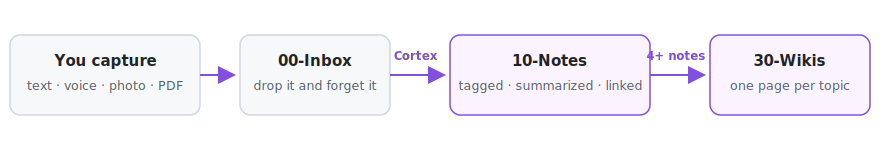
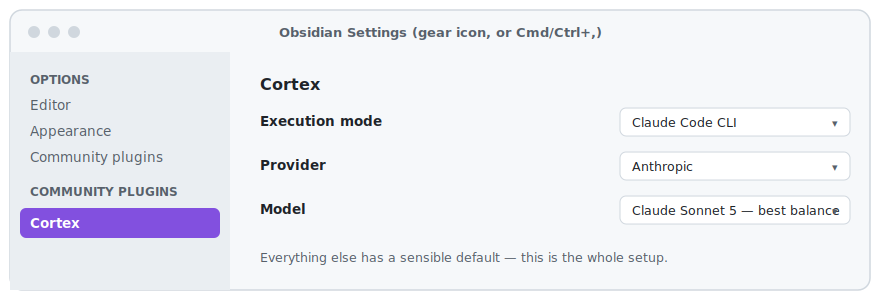
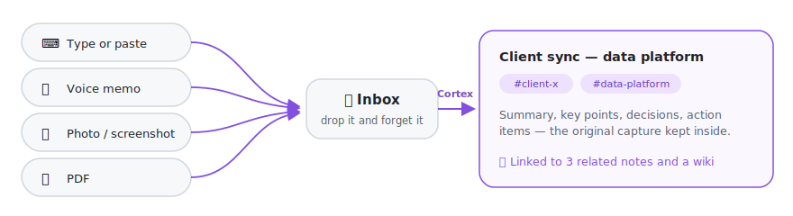

# Cortex

Capture anything — a typed thought, a voice memo, pasted meeting notes, a
photo, a PDF — and Cortex turns it into a tagged, linked knowledge graph
inside Obsidian.
Every capture gets summarized and connected to related notes automatically,
and once a topic has enough notes behind it, Cortex writes a wiki page
pulling everything together.

No coding needed. Everything happens inside Obsidian.

<picture>
  <source media="(prefers-color-scheme: dark)" srcset="assets/pipeline-dark.svg">
  
</picture>

## What you need

- [Obsidian](https://obsidian.md) (free)
- One of these:
  - A **Claude subscription** (Pro or Max), plus
    [Claude Code](https://docs.claude.com/claude-code) installed once
  - An **API key** from Anthropic, OpenAI, or Gemini
  - A **local model** (e.g. [Ollama](https://ollama.com)) — free, nothing
    ever leaves your machine

## Install

1. In Obsidian: **Settings → Community plugins**, turn community plugins on.
2. Install and enable the **BRAT** plugin from the Community plugins browser.
3. Command palette (`Cmd/Ctrl+P`) → **"BRAT: Add a beta plugin"** → paste
   `AndyMDH/obsidian-cortex`.
4. Back in **Settings → Community plugins**, turn **Cortex** on.

BRAT keeps Cortex updated automatically from then on.

## Set up

**A setup wizard opens the first time you enable Cortex** — it walks you
through the one choice below, checks the connection, and can drop a sample
note into your inbox so you watch your first enrichment happen. (Rerun it
anytime: command palette → "Cortex: Open setup wizard".)

Prefer doing it by hand? All settings live inside Obsidian (nothing to
configure on your computer itself). Open **Obsidian's settings** — the gear
icon bottom-left, or `Cmd/Ctrl+,` — and click **Cortex** in the left
sidebar. One choice to make:

<picture>
  <source media="(prefers-color-scheme: dark)" srcset="assets/settings-nav-dark.svg">
  
</picture>

- **Claude subscription (Pro/Max)?** Set **Execution mode** to
  "Claude Code CLI". Done.
- **API key instead?** Set it to "Direct API key", pick your **Provider**,
  and paste your key (or your base URL, for a local model). Done.

Everything else has a sensible default, and a **Test connection** button in
the same panel confirms your choice works before you capture anything.

## Use it

The fastest way in: click the **➕ quick capture** icon in the left sidebar
(or command palette → "Cortex: Quick capture") — type, paste, or attach an
image/PDF/voice memo, hit Capture, done. Or drop anything straight into the
**`00-Inbox`** folder — same result:

<picture>
  <source media="(prefers-color-scheme: dark)" srcset="assets/capture-ways-dark.svg">
  
</picture>

- **Type or paste** — quick capture, or a note (`Cmd/Ctrl+N`) in `00-Inbox`
- **Voice** — see "Capture by voice" below; no extra app needed
- **Photos & screenshots** — `.png`, `.jpg`, `.webp`, `.heic` (to auto-capture
  Mac screenshots, see [`examples/`](examples/))
- **PDFs**

Within seconds, Cortex tags it, summarizes it, links it to related notes,
and files it in **`10-Notes`** — your original text, image, or recording
preserved inside. Topics with 4+ notes get a wiki page in **`30-Wikis`** (or
force one anytime: command palette → "Cortex: Build/update wikis now").

### Capture by voice

No extra software needed — Obsidian already has a recorder built in:

1. **Settings → Core plugins → turn on "Audio recorder"** (one toggle; works
   on desktop and in the Obsidian mobile app).
2. Tap the microphone icon, talk, stop. Move the recording into `00-Inbox`
   (or record while `00-Inbox` is your active folder), or attach it via
   quick capture.
3. Cortex transcribes it, then enriches the transcript like any typed note —
   with the original recording embedded in the result, still playable.

This makes your **phone** a capture device too: record a thought on the go,
and it's a tagged, linked note by the time you're back at your desk.

One requirement: transcription (speech → text) runs through **Gemini or
OpenAI**, so an API key for one of them must be set in Cortex's settings —
even in Claude Code mode, where it's used *only* for transcription. (Claude
has no audio API yet.)

<details>
<summary><strong>Power option: a system-wide dictation hotkey</strong></summary>

If you want push-to-talk capture from anywhere on your machine (not just
inside Obsidian), a dictation app that can "run a script with the
transcript" — like [Handy](https://handy.computer), free and offline — can
pipe transcripts straight into your inbox: point its external-script setting
at [`examples/dictation-capture.sh`](examples/dictation-capture.sh) and edit
the two variables at the top. Note that setting is usually all-or-nothing:
once on, the app stops typing transcripts into other apps.
</details>

Want Cortex to use a specific tag — a client, a project? Add a file with
that name in **`20-Tags`** and it'll prefer it over inventing its own.

### Ask your vault questions

Command palette → **"Cortex: Query vault"** — ask in plain language ("what
did we decide about the Q3 roadmap?") and get a direct, cited answer saved
to `40-Queries`. Needs CLI execution mode.

## If something breaks

- **Nothing happened?** Command palette → "Cortex: Process inbox now" and
  watch for an error notification.
- **"Claude not found" (CLI mode)?** Run `which claude` in Terminal and
  paste the result into the **Claude CLI path** field in Obsidian's Cortex
  settings.
- **Logs**: `.cortex/pipeline.log` (hidden file in your vault) records every
  run and error.

## Good to know

- **Obsidian must be open** — captures wait in `00-Inbox` until it is, then
  get processed.
- **CLI mode is desktop-only**; use Direct API key mode on mobile.
- **One image, PDF, or recording per note.** HEIC photos need macOS to
  convert; PDFs need Anthropic, Gemini, or CLI mode; audio needs a Gemini or
  OpenAI key for transcription.
- **API keys are stored in plain text** in your vault's settings file —
  keep the vault out of shared backups.
- **Privacy**: only your captured notes, tag names, and recent note titles
  are ever sent to the provider you chose. Local mode sends nothing
  anywhere. No telemetry, ever.

## For developers

```bash
npm install
npm run dev      # rebuild as you edit
npm run build    # typecheck + final main.js
npm test         # no live API/CLI calls
```

Core logic lives in `src/` with no Obsidian dependency (tested with Node's
test runner); `main.ts` wires it to the real app.

## License

MIT — see [LICENSE](LICENSE).
