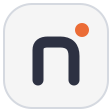
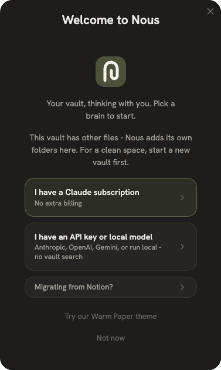
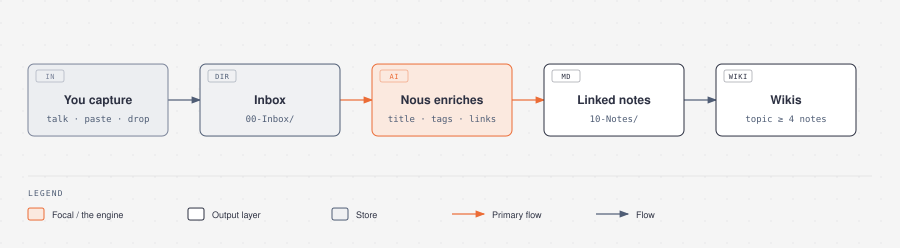

<p align="center">
  
</p>

<h1 align="center">Nous</h1>

<p align="center">
  <em>Nous</em> — Greek <em>νοῦς</em>, "mind." Capture anything. Get tagged,
  linked notes back. You run no command.
</p>

<p align="center">
  <a href="https://obsidian.md/plugins?id=nous">Install</a> ·
  <a href="docs/TUTORIAL.md">Tutorial</a> ·
  <a href="docs/USAGE.md">Docs</a> ·
  <a href="https://github.com/AndyMDH/obsidian-nous/issues">Issues</a> ·
  <a href="CHANGELOG.md">Changelog</a> ·
  <a href="CONTRIBUTING.md">Contributing</a>
</p>

<p align="center">
  <a href="https://obsidian.md/plugins?id=nous"></a>
  <a href="https://obsidian.md/plugins?id=nous"></a>
  <a href="https://github.com/AndyMDH/obsidian-nous/stargazers"></a>
  <a href="LICENSE"></a>
  <a href="https://github.com/AndyMDH/obsidian-nous/releases/latest"></a>
  <a href="https://github.com/AndyMDH/obsidian-nous/actions/workflows/ci.yml"></a>
  
  <a href="CONTRIBUTING.md"></a>
</p>

<p align="center">
  
</p>

Nous turns anything you capture into a tagged note. A capture can be a
thought, a voice memo, a call, a photo, or a PDF. Nous links each new note
to related notes on its own. Once a topic has enough notes, Nous writes a
wiki page for it and keeps that page current.

Nous keeps your data on your machine by default. It works with the Claude
Code app, local speech-to-text, or Ollama. An API key is optional.

**Works on:** Mac, Windows, and Linux computers. Meeting capture needs a
Mac.

## Contents

- [Get started](#get-started)
- [Features](#features)
- [How it works](#how-it-works)
- [Documentation](#documentation)
- [For developers](#for-developers)
- [License](#license)

## Get started

Just go through the wizard. It walks you through every step below.

**1. Install Nous.**

1. Open Obsidian.
2. Go to Settings, then Community plugins.
3. Turn on community plugins.
4. Click Browse.
5. Search for "Nous."
6. Click Install, then click Enable.

**2. Go through the wizard.**

A wizard opens on its own. Follow it, screen by screen.

1. Pick how Nous writes your notes. Choose a Claude subscription, an API
   key, or a free local model.
2. The wizard offers two more setups: voice notes and meeting capture.
   Each needs one click to install. You can skip both for now and finish
   them later, in Settings → Nous.

<p align="center">
  
</p>

**3. Capture something.**

- Click the microphone icon for a voice note.
- Click the phone icon for a meeting. Mac only.
- Drop any other file into the `00-Inbox` folder.

**4. Check your note.**

Wait a few seconds. Open the `10-Notes` folder. Your new note is there,
tagged and linked to related notes.

*Note: Obsidian must stay open for Nous to work. If Obsidian is closed, a
new capture waits in `00-Inbox` until you open it again.*

## Features

| | | |
|---|---|---|
| 🎙️ | **Capture anything** | Type, paste, drop a file, or record a voice note or a meeting. Meeting capture is Mac only. |
| 🏷️ | **Automatic tags** | Every capture gets tags from a fixed list. You sort nothing by hand. |
| 🔗 | **Automatic links** | Related notes connect to each other on their own. |
| 📖 | **Self-updating wikis** | Once a topic has enough notes, Nous writes and keeps a wiki page for it. |
| 🔒 | **Local-first** | The Claude Code app, local speech-to-text, and Ollama keep data on your machine. An API key is optional. |
| 🎨 | **A clean look, on by default** | A clean header and a folded transcript replace the raw properties list. See [the Nous look](docs/USAGE.md#the-nous-look). |
| 🧠 | **Your vault as AI context** | Point Claude Code at your vault. Every project then knows about your tagged notes, for free. [Why this works](https://xebia.com/blog/personal-rag-without-the-drag/). |

## How it works

<p align="center">
  
</p>

- **Voice notes** turn to text in one of two ways. With a Gemini or OpenAI
  key, Nous needs no extra install. Without a key,
  [whisper.cpp](https://github.com/ggml-org/whisper.cpp) does the work on
  your Mac instead, and your voice never leaves your computer. This way
  needs a two-click install.
- **Meeting capture** uses a small helper program, `nous-recorder`. It
  needs one click to install. A live note opens while Nous records. When
  you stop, an online call becomes a `Me:`/`Them:` dialogue. An in-person
  meeting becomes one plain transcript.
- **Privacy.** Nous sends only your captured notes and tag names to the
  provider you picked. Local mode sends nothing anywhere. Nous collects no
  usage data.
- **Limits.** In a group call, Nous shows every other speaker as one
  `Them:` voice. Meeting capture needs macOS 15 or later. Live voice
  transcription is a beta feature and needs an OpenAI key.

For more detail, read [`docs/ARCHITECTURE.md`](docs/ARCHITECTURE.md) or
[`docs/USAGE.md`](docs/USAGE.md).

## Documentation

| | |
|---|---|
| [`docs/TUTORIAL.md`](docs/TUTORIAL.md) | A slow, step-by-step walkthrough of your first hour with Nous. |
| [`docs/USAGE.md`](docs/USAGE.md) | Every provider, hotkey, and troubleshooting step. |
| [`docs/ARCHITECTURE.md`](docs/ARCHITECTURE.md) | The design behind Nous — layers, data flow, and choices. |
| [`docs/TECHNICAL.md`](docs/TECHNICAL.md) | A map of the code, for contributors. |

## For developers

```bash
npm install && npm run build && npm test
npm run build:recorder
npm run build:recorder:universal && npm run package:recorder
```

Core logic lives in `src/` and needs no Obsidian dependency. `main.ts`
connects it to the app. The native Mac meeting helper lives in
`native/nous-recorder/`.

## License

MIT — see [LICENSE](LICENSE).
