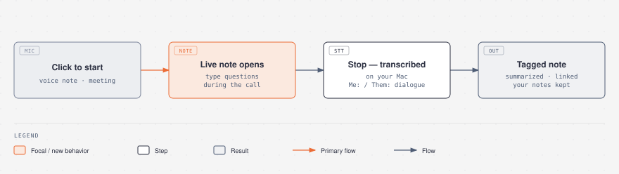

<p align="center">
  
</p>

<h1 align="center">Nous</h1>

<p align="center">
  <em>Nous</em> — Greek <em>νοῦς</em>, "mind." Capture anything. Get a tagged,
  linked knowledge graph back — automatically.
</p>

<p align="center">
  Most similar tools make you trigger tagging, linking, or wiki-building by
  hand, one step at a time. Nous runs the whole pipeline live in the
  background as you capture — tagging, linking, and synthesizing a
  self-updating wiki page once a topic earns one, no command to run.
</p>

<p align="center">
  <a href="https://obsidian.md/plugins?id=nous"></a>
  <!-- TODO: swap back to the dynamic downloads badge once "nous" has an
       entry in obsidianmd/obsidian-releases community-plugin-stats.json -
       it doesn't yet, so the dynamic query badge renders broken. -->
  
  <a href="LICENSE"></a>
  <a href="https://github.com/AndyMDH/obsidian-nous/releases/latest"></a>
  <a href="https://github.com/AndyMDH/obsidian-nous/actions/workflows/ci.yml"></a>
  
</p>

<p align="center">
  
</p>

A typed thought, a voice memo, a call, a photo, a PDF — Nous turns whatever
you capture into a summarized, tagged note, linked to everything related.
Text, images, and PDFs work after the connection check. Voice notes and calls
may ask for speech-to-text or macOS recorder setup.

**Works on:** Desktop (macOS, Windows, Linux) and Mobile (API-key or local-model
mode). Meeting capture is macOS-only; live voice transcription (beta) is
desktop-only.

## Features

- 📥 **Capture anything** — typed notes, voice memos, calls, photos, PDFs
- 🏷️ **Tagged and linked automatically** — from a controlled vocabulary,
  not freeform tag sprawl
- 📖 **Self-updating wikis** — once a topic has enough notes, Nous writes a
  hub page pulling them together
- 🎙️ **Live voice transcription** (beta) — watch text appear as you talk
- 🤖 **Great context for AI coding assistants** — real tags and linked wikis
  beat a pile of raw notes; point Claude Code's global `CLAUDE.md` at your
  vault and every project gets that context automatically
- 🔒 **Local-first** — Claude Code CLI, local whisper.cpp, and Ollama send
  nothing off your machine; direct API keys are opt-in
- 📱 **Works on mobile** — with a direct API key

## Install

1. In Obsidian: **Settings → Community plugins**, turn community plugins on.
2. **Browse**, search **"Nous"**, click **Install**, then **Enable**.

Or jump straight to [Nous's page on Obsidian's site](https://obsidian.md/plugins?id=nous).

## Quickstart

**1. Enable Nous** — a setup wizard opens automatically. First, choose how
Nous should write notes: a Claude subscription, a free local model, or an API
key. Then the wizard checks the optional voice and meeting setup.

<p align="center">
  
</p>

**2. Capture something.** Four ways in, all in the left sidebar — 🎙️ and
📞 both click to start, talk, click the same button again to stop:

| | | |
|---|---|---|
| ➕ | Type, paste, or attach a file | command palette → "Nous: Quick capture" |
| 🎙️ | Voice note | click the mic |
| 📞 | Meeting (macOS) | click the phone — Nous opens a live note where you can type questions while it records |
| 📥 | Anything else | drop it straight into `00-Inbox` |

<p align="center">
  
</p>

**3. That's it.** Within seconds your capture is tagged, summarized, and
linked to related notes in **`10-Notes`** — original text, image, or
recording kept inside. Topics with 4+ notes get their own wiki page in
**`30-Wikis`** automatically.

*Already have a vault structure?* `00-Inbox`/`10-Notes`/`20-Tags`/`30-Wikis`
are just defaults — every folder name is configurable in Settings → Nous, so
Nous can point at folders you already use instead.

## How it works, briefly

- **Voice transcription needs one extra backend** —
  [whisper.cpp](https://github.com/ggml-org/whisper.cpp) runs locally on
  your Mac; voice never leaves it. Without that, add a Gemini/OpenAI key used
  only for speech-to-text.
- **Meetings** are captured with the native `nous-recorder` helper on macOS:
  setup can install it for you, then the phone button uses it directly. It
  opens a live note in Obsidian when recording starts, so you can type
  questions and quick notes during the call. When you stop, Nous adds the
  transcript to that same note. It records system audio (`Them`) and your mic
  (`Me`) separately, then merges both into a chronological, speaker-labeled
  dialogue. If
  speech-to-text is not ready yet, the recording and your typed notes still
  wait in the inbox until you finish setup.
- **Limitation**: group calls lump every other participant into one `Them:`
  speaker — there's no per-person diarization.
- **Limitation**: meeting capture is macOS-only, and recording your own mic
  needs macOS 15+ — on macOS 14 only the other side (`Them:`) is captured.
  Live voice transcription (beta) is OpenAI-only and desktop-only.

Full pipeline detail → [`docs/ARCHITECTURE.md`](docs/ARCHITECTURE.md).

## Ecosystem

- **[Obsidian LLM Wiki](https://github.com/green-dalii/obsidian-llm-wiki)** —
  lists Nous as a companion plugin in its
  [Ecosystem section](https://github.com/green-dalii/obsidian-llm-wiki#-ecosystem)
  for local voice memo and meeting capture. Independent of that plugin — both
  can share the same vault without coupling.

## Good to know

- **Obsidian must be open** for captures to process — they wait in
  `00-Inbox` until it is.
- **Privacy**: only your captured notes and tag names are ever sent to the
  provider you chose. Local mode sends nothing anywhere. No telemetry, ever.
- **Mobile**: use Direct API key mode — Claude Code CLI is desktop-only.
- **Hotkeys**: every capture action (voice, meeting, quick capture, process
  inbox now, ...) is a real Obsidian command, not just a ribbon icon —
  **Settings → Hotkeys**, search "Nous", bind whichever ones you use often.
- **Settings** show just the essentials by default — CLI/recorder/whisper paths,
  folder names, and tuning thresholds are one click away under **Advanced
  settings**, since defaults work for almost everyone.
- **AI context, concretely**: add a line to Claude Code's global
  `~/.claude/CLAUDE.md` (e.g. "My notes live in `~/path/to/vault` — check
  `10-Notes`/`20-Tags`/`30-Wikis` for relevant background") and every project
  gets that context automatically, no extra setup per-project.

## Documentation

| | |
|---|---|
| [`docs/TUTORIAL.md`](docs/TUTORIAL.md) | New to Nous? A slower, hand-holding walkthrough of your first hour. |
| [`docs/USAGE.md`](docs/USAGE.md) | Every provider, hotkey, and troubleshooting step. |
| [`docs/ARCHITECTURE.md`](docs/ARCHITECTURE.md) | The conceptual model — layers, data flow, design principles. |
| [`docs/TECHNICAL.md`](docs/TECHNICAL.md) | Code map and implementation detail, for contributors. |

## For developers

```bash
npm install && npm run build && npm test
npm run build:recorder
npm run build:recorder:universal && npm run package:recorder
```

Core logic lives in `src/` with no Obsidian dependency; `main.ts` wires it
to the app. The native macOS meeting helper lives in `native/nous-recorder/`.

## License

MIT — see [LICENSE](LICENSE).
