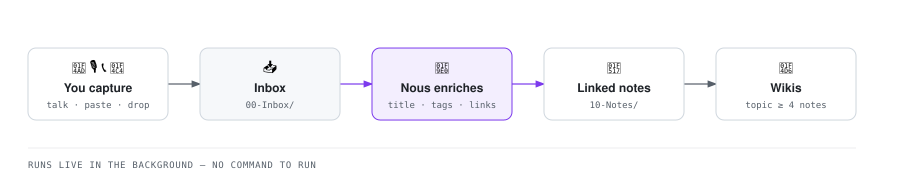
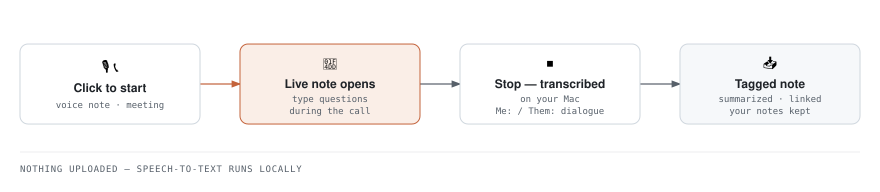

<p align="center">
  
</p>

<h1 align="center">Nous</h1>

<p align="center">
  <em>Nous</em> — Greek <em>νοῦς</em>, "mind." Capture anything. Get a tagged,
  linked knowledge graph back — automatically.
</p>

<p align="center">
  <a href="https://obsidian.md/plugins?id=nous"></a>
  
  <a href="LICENSE"></a>
  <a href="https://github.com/AndyMDH/obsidian-nous/releases/latest"></a>
  <a href="https://github.com/AndyMDH/obsidian-nous/actions/workflows/ci.yml"></a>
  
</p>

<p align="center">
  <picture>
    <source media="(prefers-color-scheme: dark)" srcset="assets/pipeline-dark.svg">
    
  </picture>
</p>

A typed thought, a voice memo, a call, a photo, a PDF — Nous turns whatever
you capture into a summarized, tagged note, linked to everything related.
No coding, nothing to configure by hand. Everything happens inside Obsidian.

**Works on:** Desktop (macOS, Windows, Linux) and Mobile (API-key or local-model
mode). Meeting capture is macOS-only; live voice transcription (beta) is
desktop-only — see [Limitations](#how-it-works-briefly) below.

## Features

- 📥 **Capture anything** — typed notes, voice memos, calls, photos, PDFs
- 🏷️ **Tagged and linked automatically** — from a controlled vocabulary,
  not freeform tag sprawl
- 📖 **Self-updating wikis** — once a topic has enough notes, Nous writes a
  hub page pulling them together
- 🎙️ **Live voice transcription** (beta) — watch text appear as you talk
- 🔒 **Local-first** — Claude Code CLI, local whisper.cpp, and Ollama send
  nothing off your machine; direct API keys are opt-in
- 📱 **Works on mobile** — with a direct API key

## Install

1. In Obsidian: **Settings → Community plugins**, turn community plugins on.
2. **Browse**, search **"Nous"**, click **Install**, then **Enable**.

Or jump straight to [Nous's page on Obsidian's site](https://obsidian.md/plugins?id=nous).

## Quickstart

**1. Enable Nous** — a setup wizard opens automatically and asks one
question: Claude subscription, an API key, or a local model? Pick one, it
tests the connection, done.

**2. Capture something.** Four ways in, all in the left sidebar — 🎙️ and
📞 both click to start, talk, click the same button again to stop:

| | | |
|---|---|---|
| ➕ | Type, paste, or attach a file | command palette → "Nous: Quick capture" |
| 🎙️ | Voice note | click the mic |
| 📞 | Meeting (macOS) | click the phone, or ⌥M — [one-time setup](examples/meeting-capture/) |
| 📥 | Anything else | drop it straight into `00-Inbox` |

<p align="center">
  <picture>
    <source media="(prefers-color-scheme: dark)" srcset="assets/capture-scenario-dark.svg">
    
  </picture>
</p>

**3. That's it.** Within seconds your capture is tagged, summarized, and
linked to related notes in **`10-Notes`** — original text, image, or
recording kept inside. Topics with 4+ notes get their own wiki page in
**`30-Wikis`** automatically.

*Already have a vault structure?* `00-Inbox`/`10-Notes`/`20-Tags`/`30-Wikis`
are just defaults — every folder name is configurable in Settings → Nous, so
Nous can point at folders you already use instead.

## How it works, briefly

- **Transcription is local by default** — [whisper.cpp](https://github.com/ggml-org/whisper.cpp)
  runs on your Mac; voice never leaves it. Falls back to a Gemini/OpenAI key
  if that's not installed.
- **Meetings** are captured via [QuickRecorder](https://github.com/lihaoyun6/QuickRecorder)
  recording system audio and your mic as two separate tracks, transcribed
  independently, then interleaved by timestamp into `Me:` / `Them:` dialogue.
- **Limitation**: group calls lump every other participant into one `Them:`
  speaker — there's no per-person diarization.
- **Limitation**: meeting capture is macOS-only; live voice transcription
  (beta) is OpenAI-only and desktop-only.

Full pipeline detail → [`docs/ARCHITECTURE.md`](docs/ARCHITECTURE.md).

## Good to know

- **Obsidian must be open** for captures to process — they wait in
  `00-Inbox` until it is.
- **Privacy**: only your captured notes and tag names are ever sent to the
  provider you chose. Local mode sends nothing anywhere. No telemetry, ever.
- **Mobile**: use Direct API key mode — Claude Code CLI is desktop-only.
- **Settings** show just the essentials by default — CLI/whisper paths,
  folder names, and tuning thresholds are one click away under **Advanced
  settings**, since defaults work for almost everyone.

## Documentation

| | |
|---|---|
| [`docs/TUTORIAL.md`](docs/TUTORIAL.md) | New to Nous? A slower, hand-holding walkthrough of your first hour. |
| [`docs/USAGE.md`](docs/USAGE.md) | Every provider, hotkey, and troubleshooting step. |
| [`docs/ARCHITECTURE.md`](docs/ARCHITECTURE.md) | The conceptual model — layers, data flow, design principles. |
| [`docs/TECHNICAL.md`](docs/TECHNICAL.md) | Code map and implementation detail, for contributors. |

## For developers

```bash
npm install && npm run build && npm test
```

Core logic lives in `src/` with no Obsidian dependency; `main.ts` wires it
to the app.

## License

MIT — see [LICENSE](LICENSE).
