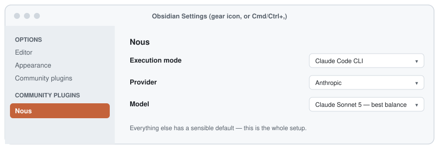

# Tutorial: your first hour with Nous

The [README](../README.md) is a fast reference; [USAGE.md](USAGE.md) is
full detail on every option. This page is neither — it's a slow, hand-holding
walkthrough for the first time you actually use Nous, written for someone who
has never touched it before.

## What Nous actually does, in plain terms

You give it something — typed text, a voice memo, a pasted meeting
transcript, a photo, a PDF — and within seconds it comes back as a tidy note:
titled, summarized, tagged, and linked to anything related you've already
captured. You never format or file anything yourself.

Everything lives in four folders it manages for you:

| Folder | What's in it |
|---|---|
| `00-Inbox` | Where a capture briefly sits before Nous processes it |
| `10-Notes` | Finished notes — this is where you'll actually read things |
| `20-Tags` | One file per tag, so tags are visible/clickable in your graph |
| `30-Wikis` | Hub pages Nous writes once a topic has enough notes behind it |

You'll mostly only ever look at `10-Notes` and occasionally `30-Wikis`. The
rest runs itself.

## Step 1: install and the setup wizard

1. Settings → Community plugins → turn on community plugins if you haven't
   already → **Browse** → search "Nous" → **Install** → **Enable**.
2. A setup wizard opens by itself the first time. It asks exactly one
   question: how should Nous think? Three options:
   - **Claude subscription** — if you already pay for Claude Pro/Max and have
     [Claude Code](https://docs.claude.com/claude-code) installed, this is
     free (no separate billing).
   - **A local model** (e.g. [Ollama](https://ollama.com)) — free, ~2 min
     setup, and nothing ever leaves your machine.
   - **An API key** — Anthropic, OpenAI, Gemini, or Z.ai. Billed separately,
     but works on mobile too.
3. Pick one, the wizard tests it, and offers to drop a sample note in your
   inbox so you can watch the whole thing happen once, live.

  <picture>
    <source media="(prefers-color-scheme: dark)" srcset="../assets/settings-nav-dark.svg">
    
  </picture>

If you skip that sample note or want to redo setup later: command palette
(`Cmd/Ctrl+P`) → "Nous: Open setup wizard."

## Step 2: your first capture (the simplest way)

No extra setup needed for this one — good first test that everything's
wired up correctly:

1. Command palette → **"Nous: Quick capture."**
2. Type a sentence or two — anything. E.g. "Testing Nous - this should turn
   into a real note in a few seconds."
3. Click **Capture** (or just press Enter).
4. Wait a few seconds, then look in **`10-Notes`**. A new file has appeared:
   a real title (not "Testing Nous"), a short summary, 1-4 tags, and your
   original text preserved underneath.

If that worked, everything's connected correctly and the rest of this page
is just "here are the other ways to feed it."

## Step 3: what just happened

Worth understanding once, so it stops feeling like magic:

1. Your text landed in `00-Inbox`.
2. Nous noticed the new file (it watches that folder the whole time Obsidian
   is open) and sent it off to be enriched — read, summarized, tagged from
   your existing tag list where possible (it's deliberately reluctant to
   invent brand new tags), and checked against your recent notes for
   anything related worth linking.
3. The finished note got written into `10-Notes` — your original text is
   never discarded, only added to underneath the generated summary.

Once a tag accumulates 4+ notes, Nous also writes a **wiki page** in
`30-Wikis` pulling them all together — you'll see this happen naturally as
you use it more, nothing to trigger yourself.

  <picture>
    <source media="(prefers-color-scheme: dark)" srcset="../assets/pipeline-dark.svg">
    
  </picture>

## Step 4: your first voice note

Voice notes need speech-to-text first. On macOS, install local `whisper.cpp`
for private on-device transcription; otherwise add a Gemini/OpenAI key in
Nous settings. If neither is set up, Nous will show a setup message and will
not start recording.

1. Click the **🎙️ mic icon** in Obsidian's left sidebar.
2. Talk for a few seconds.
3. Click the mic icon again to stop.
4. Same as before — check `10-Notes` in a few seconds. The note now also has
   your original recording embedded and playable inside it.

  <picture>
    <source media="(prefers-color-scheme: dark)" srcset="../assets/capture-scenario-dark.svg">
    
  </picture>

The same click-to-start, click-to-stop gesture is used for meeting capture
in Step 6 below — just the phone icon instead of the mic.

Prefer to see the words appear *while* you're still talking, Siri-style,
rather than only after you stop? Settings → Nous → turn on **Advanced
settings** → add an OpenAI API key → turn on **Live voice transcription
(beta)**. It's optional and off by default (OpenAI-only for now, desktop
only) — the plain version above works everywhere with no extra setup, using
a free local transcription engine (whisper.cpp) if you have it installed, or
falling back to a Gemini/OpenAI key otherwise.

## Step 5: photos, PDFs, and pasted meeting transcripts

- **Photo or screenshot**: drop a `.png`/`.jpg`/`.webp`/`.heic` file straight
  into `00-Inbox`, or attach one via quick capture (the paperclip-style
  "Attach file" button in the same modal as Step 2).
- **PDF**: same — attach via quick capture, or drop it into `00-Inbox`
  directly.
- **A transcript you already have** (copied from Teams/Zoom/Granola/etc.):
  paste it into quick capture like any other text. Nous treats it the same
  as a recorded meeting.

## Step 6: recording an actual meeting (macOS)

This one needs a tiny bit of one-time setup, because capturing *both sides*
of a call (not just your own mic) needs a real macOS recording permission
that Obsidian's browser mic recorder cannot provide by itself. Nous uses a
small native helper for this.

1. If the setup wizard says the native recorder is missing, click
   **Install**. Nous downloads the helper from the matching release, verifies
   its checksum, and stores it in this vault's plugin folder.
2. After that: click the **📞 phone icon** when a call starts, click it again
   when it ends. A speaker-labeled transcript lands in your inbox and comes
   back enriched, same as everything else.

If you do not install the native helper, Nous can still use the older
QuickRecorder fallback. QuickRecorder is not included with macOS; the fallback
setup is documented in [`../examples/meeting-capture/`](../examples/meeting-capture/).

## Where to go from here

- Something not behaving? [USAGE.md](USAGE.md#if-something-breaks) has
  actual troubleshooting steps, not just "here's how it should work."
- Want the full list of settings, hotkeys, and every capture method in
  depth? [USAGE.md](USAGE.md) is the complete reference.
- Curious how the pipeline is actually built? [ARCHITECTURE.md](ARCHITECTURE.md)
  and [TECHNICAL.md](TECHNICAL.md).
