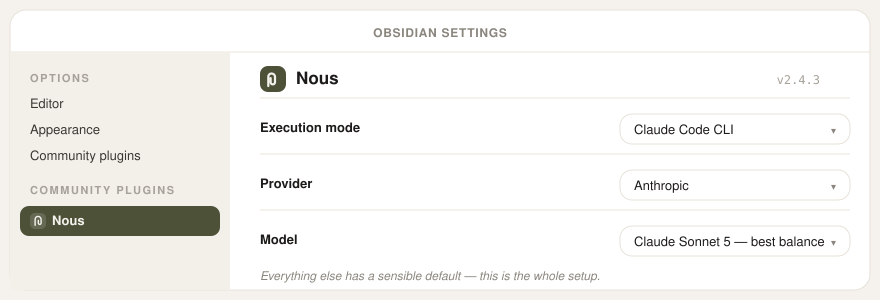

# Nous usage guide

The full detail behind the README's quickstart: provider setup options,
every capture method in depth, how the pipeline works internally, and
troubleshooting. If you just want to get going, the README is enough —
come back here when you need specifics.

## Installing beta updates early

Want new releases before the official directory picks them up? Install
[BRAT](https://github.com/TfTHacker/obsidian42-brat) from Community
plugins, then command palette → **"BRAT: Add a beta plugin"** → paste
`AndyMDH/obsidian-nous`. BRAT tracks new GitHub releases immediately
instead of waiting for the directory to sync — everything else about setup
and use is identical.

## What you need

- [Obsidian](https://obsidian.md) (free)
- One of these:
  - A **Claude subscription** (Pro or Max), plus
    [Claude Code](https://docs.claude.com/claude-code) installed once
  - An **API key** from Anthropic, OpenAI, Gemini, or [Z.ai](https://z.ai)
    (GLM-5.2 and other GLM models)
  - A **local model** (e.g. [Ollama](https://ollama.com)) — free, nothing
    ever leaves your machine

> **Desktop vs mobile:** Claude Code CLI mode only works on desktop. Use a
> direct API key on mobile.

## Set up

**A setup wizard opens the first time you enable Nous** — it helps you choose
how Nous writes notes, checks the connection, checks optional voice and meeting
setup, and can drop a sample note into your inbox so you watch your first
enrichment happen. (Rerun it anytime: command palette → "Nous: Open setup
wizard".)

Prefer doing it by hand? Start in **Obsidian's settings** — the gear icon
bottom-left, or `Cmd/Ctrl+,` — and click **Nous** in the left sidebar. Choose
how Nous writes notes first; voice notes and meeting recording have their own
setup rows below that.

- **Claude subscription (Pro/Max)?** Set **Execution mode** to
  "Claude Code CLI", then run **Test connection**.
- **API key instead?** Set it to "Direct API key", pick your **Provider**,
  and paste your key (or your base URL, for a local model), then run
  **Test connection**.

After that, text and file capture are ready. Voice notes and meeting recording
show their own setup rows in the same settings panel.
Rarely-touched fields — CLI/recorder/whisper paths, folder names, tuning thresholds —
are hidden behind an **Advanced settings** toggle at the bottom of the panel.

## Every way to capture

- **➕ Type or paste** — quick capture, or a note (`Cmd/Ctrl+N`) in `00-Inbox`
- **🎙️ Voice** — click the mic icon (or a hotkey), talk, click again
- **📷 Photos & screenshots** — `.png`, `.jpg`, `.webp`, `.heic` (to
  auto-capture Mac screenshots, see [`../examples/`](../examples/))
- **📄 PDFs** — attach one via quick capture, or drop it in `00-Inbox`

Within seconds, Nous tags it, summarizes it, links it to related notes,
and files it in **`10-Notes`** — your original text, image, or recording
preserved inside. Topics with 4+ notes get a wiki page in **`30-Wikis`** (or
force one anytime: command palette → "Nous: Build/update wikis now").

### Voice capture, in depth

Click the **🎙️ mic icon** in the left sidebar (or command palette →
"Nous: Toggle voice capture") to start recording, click it again to stop.
That's the whole thing — the recording drops into the inbox and comes back
as a tagged, summarized note with the audio still playable inside.

Voice notes need speech-to-text before they can become notes. On macOS, Nous
can use local `whisper.cpp` if `whisper-cli` and a model are installed. If
not, add a Gemini or OpenAI API key; that key is used only for transcription
when your main enrichment mode is Claude, GLM, Anthropic, or local. If neither
path is available, Nous shows a setup message and does not start recording.

Prefer a hotkey? **Settings → Hotkeys**, search "Nous: Toggle voice
capture", give it a key — same command, your choice which trigger you use.
Any audio file dropped in `00-Inbox` also works, including recordings made
in the Obsidian **mobile** app on the go.

**Live voice transcription (beta)** — **Settings → Nous → Live voice
transcription (beta)**, off by default. Turn it on (with an OpenAI API key
set) and the same 🎙️ mic icon opens a small window instead: the transcript
grows on screen while you talk, Siri-style, rather than only appearing after
you click Stop. Click **Stop** to finish and save (same inbox → note
pipeline as always), or **Cancel** to explicitly discard the recording — no
file is created. Closing the window with Esc or a click outside is treated
the same as Stop, not a silent discard.

This is desktop-only (uses OpenAI's Realtime API over a Node WebSocket,
which needs Electron's Node integration) and needs an OpenAI key — without
either, the toggle simply has no effect and the mic icon behaves exactly as
before. The same is true if a live connection never starts or drops
mid-recording: the underlying recording keeps going regardless, and once you
stop, it's transcribed by the normal batch pipeline (local whisper.cpp, or
Gemini/OpenAI) exactly as if live mode had never been turned on — a capture
is never lost because live transcription had trouble.

Transcription (speech → text) prefers **local whisper.cpp** on macOS if
`whisper-cli` and a model are installed (`brew install whisper-cpp`, path
configurable under Nous's **Advanced settings**) — nothing leaves your
machine, no API key needed. Without that set up, it falls back to a **Gemini
or OpenAI** API key in Nous's settings, even in Claude Code or GLM mode, where
it's used *only* for transcription (Claude and GLM have no audio API yet).

<strong>Power option: a system-wide dictation hotkey</strong>

If you want push-to-talk capture from anywhere on your machine (not just
inside Obsidian), a dictation app that can "run a script with the
transcript" — like [Handy](https://handy.computer), free and offline — can
pipe transcripts straight into your inbox: point its external-script setting
at [`../examples/dictation-capture.sh`](../examples/dictation-capture.sh)
and edit the two variables at the top. Note that setting is usually
all-or-nothing: once on, the app stops typing transcripts into other apps.

### Meeting capture, in depth (macOS)

Calls with other people need system-audio capture, which Obsidian's browser
mic recorder cannot hear. Nous prefers a small native macOS helper,
`nous-recorder`, so the phone button can start and stop a meeting recording
directly.

If the helper is missing, the setup wizard and Settings → Nous → Meeting
capture show an **Install** button. Click it once. Nous downloads its recorder,
checks the download, puts it in this vault's plugin folder, checks that it can
run, and uses it automatically. If you put your own helper somewhere else,
open Settings → Nous → Advanced settings and set
**Nous Recorder path** to the full path.

Then click the **📞 phone icon** in the left sidebar (or command palette →
"Nous: Toggle meeting capture") when the meeting starts, and click it again
when it ends. First run may trigger macOS microphone and screen/system-audio
permission prompts for Obsidian or the helper; allow them, then try the
button again if macOS interrupted the first capture.

When recording starts, Nous opens a live note in Obsidian with one open
**Notes** section. Type anything there during the call. When you stop
recording, Nous adds the speaker-labeled transcript to that same note, then
enriches it like any other inbox item. The status bar shows the state:
recording, then transcribing.
`Me:` is your mic; `Them:` is system audio from the call, merged into one
chronological dialogue. Mic capture needs macOS 15+ — on macOS 14 the
transcript is `Them:`-only.

If speech-to-text is not ready yet, Nous still records the meeting. When you
stop, the live note stays in the inbox and says it needs transcription. Your
typed questions and notes stay there too. Add local `whisper.cpp` or a
Gemini/OpenAI key later, then run command palette → "Nous: Process inbox now".
Nous will finish that saved recording.

Want Nous to use a specific tag — a client, a project? Add a file with
that name in **`20-Tags`** and it'll prefer it over inventing its own.

### Ask your vault questions

Command palette → **"Nous: Query vault"** — ask in plain language ("what
did we decide about the Q3 roadmap?") and get a direct, cited answer saved
to `40-Queries`. Needs CLI execution mode.

## How it works

The slightly technical version of what happens between dropping a capture
and seeing a linked note. (Full detail:
[`ARCHITECTURE.md`](ARCHITECTURE.md) and [`TECHNICAL.md`](TECHNICAL.md).)

1. **Watch.** The plugin listens for file-create events in `00-Inbox` (plus
   a catch-up scan when Obsidian opens, since plugins only run while
   Obsidian does). New files get a 2-second settle delay — dictation and
   sync tools often create-then-rewrite.

2. **Normalize by type.** Markdown/text is read as-is. Images and PDFs are
   base64-encoded into vision/document content blocks (HEIC is converted to
   JPEG first via macOS's `sips`). Audio is **transcribed first** — local
   `whisper.cpp` when installed (macOS, no API key), otherwise Gemini's
   native audio input or OpenAI's `whisper-1` — and the transcript re-enters
   the text path, which is why voice works in every execution mode.

3. **Enrich — one structured call, no free-form generation.** The model is
   forced to answer via a single `enrich_note` tool call returning JSON:
   type (meeting/note), date, title, summary, key points, decisions, action
   items, 1–4 tags drawn from the controlled vocabulary in `20-Tags` (new
   tags need justification), plus a duplicate check and related-note picks
   against an index of your recent notes. In CLI mode this step instead
   shells out to `claude -p` with a generated SKILL.md, letting Claude Code
   read the inbox itself — same contract, agentic execution.

4. **Assemble deterministically.** Plugin code — not the model — builds the
   note from that JSON: frontmatter, sections, wikilinks, your original
   text/image/recording preserved inside. The file moves to `10-Notes`;
   detected duplicates are parked in `00-Inbox/duplicates` instead of
   deleted.

5. **Synthesize.** After each run, notes are clustered by tag. Any tag
   reaching 4+ substantial notes gets a wiki page in `30-Wikis` (a second
   structured call writes the narrative; timeline and source lists are built
   deterministically from note metadata) — updated, not appended, as new
   notes arrive.

Every step is logged to `.nous/pipeline.log` in the vault.

## If something breaks

- **Nothing happened?** Command palette → "Nous: Process inbox now" and
  watch for an error notification.
- **Meeting says it needs transcription?** The audio was saved. Add local
  `whisper.cpp` or a Gemini/OpenAI key in Settings → Nous, then run
  "Nous: Process inbox now".
- **"Claude not found" (CLI mode)?** Run `which claude` in Terminal, then
  Obsidian's Nous settings → turn on **Advanced settings** → paste the
  result into **Claude CLI path**.
- **Logs**: `.nous/pipeline.log` (hidden file in your vault) records every
  run and error.

## Good to know

- **Obsidian must be open** — captures wait in `00-Inbox` until it is, then
  get processed.
- **CLI mode is desktop-only**; use Direct API key mode on mobile.
- **One image, PDF, or recording per note.** HEIC photos need macOS to
  convert; PDFs need Anthropic, Gemini, or CLI mode; audio needs either local
  `whisper.cpp` (macOS) or a Gemini/OpenAI key for transcription.
- **API keys are stored in plain text** in your vault's settings file —
  keep the vault out of shared backups.
- **Privacy**: only your captured notes, tag names, and recent note titles
  are ever sent to the provider you chose. Local mode sends nothing
  anywhere. No telemetry, ever.
